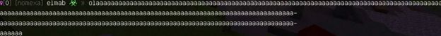
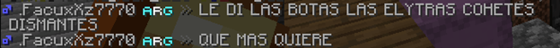

## Nuevo formato de sanciones.

(Discord y Minecraft) Este es el nuevo formato de sanciones para el
servidor **REDMC®**. Ahora les mostraremos que comportamientos deben de
ser sancionados o reportados por todos los miembros del @staffteam. Este
“nuevo” formato estará organizada de la siguiente forma:

**SANCION →** Acá estará el nombre de la sanción. En el momento de
sancionar a un usuario debes de adjuntar este nombre.

**• Descripción:** Acá daremos una corta descripción sobre lo necesario
para sancionar al usuario.

**• Ejemplo:** Acá adjuntaremos una pequeña captura relacionada con la
sanción.

**• Niveles de sanción:** Aquí mostraremos los tiempos de sanción.

------------------------------------------------------------------------

# **Formato de sanciones.**

(**Minecraft**)

A continuación, se detallan las sanciones más comunes y leves. Para cada
una, se proporcionará una breve descripción y el período de tiempo
correspondiente a su aplicación.

**SANCION →** Flood

-   **`Descripción`**: Si un usuario coloca letras sin sentido y/o
    excede los 8 caracteres será sancionado (Un ejemplo podría ser:
    “kskdakwddj”, un holaaaaa, no será sancionable)

-   **`Ejemplo:`** {width="16cm" height="4.7cm"}

-   **`Niveles de sanción:`**

#1 ➨ Warn \|

#2 y #3 ➨ Mute 1h \|

#4 - #10 ➨ Mute 2h \|

#11 - #20 ➨ Mute 5h \|

#21 - #∞ ➨ Mute 12h \|

**SANCION →** Exceso de mayúsculas

-   **`descripción:`** Solo será sancionado si el mensaje contiene un
    70% de mayúsculas (Si el usuario lo hace solo una vez no será
    sancionado, la sanción será aplicada después de exceder las
    mayúsculas en más de 2 mensajes)

-   **`Ejemplo:`** 

-   **`Niveles de sanción:`** 

#1➨ Warn \|

#2 y #3 ➨Mute 1h \|

#4 - #7 ➨Mute 3h \|

#8 - #9 ➨Mute 5h \|

#10-∞ ➨ Mute 1d \|

**Sanción →** Spam

-   **`Descripción:`** Si un usuario repite el mismo mensaje una y otra
    vez es considerado spam (Si el usuario repite el mismo mensaje un
    total de 4 veces será sancionado)

-   **`Ejemplo:`**

-   **`Niveles de sanción:`**

#1 ➨ Warn \|

#2 y #3 ➨ Mute 1h \|

#4 - #10 ➨ Mute 2h \|

#11 - #20 ➨ Mute 5h \|

#21 - #∞ ➨ Mute 12h

**`Sanción →`** Toxicidad

-   **`Descripción:`** Si el usuario o los usuarios empiezan a insultar
    con palabras fuertes, (“wey”, “nmms” no son tan fuertes). Si se
    trata de una discusión primero se intentará calmarlos, si continúan
    con el conflicto serán sancionados.

-   **`Ejemplo:`**

-   **`Niveles de sanción:`**

#1 ➨ Warn \|

#2 y #3 ➨ Mute 1h \|

#4 - #10 ➨ Mute 3h \|

#11 - #20 ➨ Mute 12h \|

#21 - #40 ➨ Ban 1d \|

#41 - ➨Mute Perma

Todas estas sanciones son las más frecuentes y deben de ser sancionadas,
pero **primero se debe de dar una advertencia por el chat** (ejemplo:
“Oye "JUGADOR", evita el spam). Todo el staff esta encargado de
sancionar estas conductas, desde los **Low Staff** hasta los **High
Staff** y **Head Staff.**

A continuación, pasaremos a otra” sección” de las sanciones.

**`SANCION →`** Faltas de respeto al Staff

**`Descripción:`** Hacer burlas, insultos o crear rumores del staff.  

**`Ejemplo:`**  

**`Niveles de sanción:`**

#1 ➨ Mute 7h \|

#2 y #3 ➨ Mute 12h \|

#4 - #7 ➨ Mute 1d \|

#8 - #∞ ➨ Ban 3d \|

**`SANCION →`** Mentir al Staff

-   **`descripción:`** Si el usuario miente sobre otro jugador con el
    fin de dañarlo será sancionado. (No importa que sea en tono de
    broma, será sancionado igual.)

-   **`Ejemplo:`**

-   **`Niveles de sanción:`**

#1 ➨ Warn \|

#2 y #3 ➨ Ban 3d \|

#4 - #7 ➨ Ban 7d \|

#8 - #∞ ➨ Ban 15d \|

-   **`SANCION →`** Suplantar identidad del Staff

-   Descripción: Si un usuario miente sobre tener acceso a los comandos
    de moderación, tener un rango dentro del staff (Soporte, helper,
    moderador, etc.) o/y directamente hacerse pasar por algún moderador
    será sancionado. (Sin importar que sea en tono de broma debe de ser
    sancionado.)

-   **`Ejemplo:`**

-   **`Niveles de sanción:`**

#1 ➨ban 3d \|

#2 y #3 ➨ Ban 10d \|

#4 - #7 ➨ Ban 30d \|

#8 - #∞ ➨ Ban 60d \|

Estas son las sanciones relacionadas al Staff, de igual forma que todas
las sanciones antes mostradas deben de ser sancionadas por igual. (Aquí
se sancionan directamente, no importa si el comentario fue en tono
humorístico.)

Ahora te mostraremos cuales son las sanciones un poco “más graves”.

**`SANCION →`** Uso de modificaciones ilegales

-   **`descripción:`** El uso de modificaciones como hacks, x-ray o
    alguna otra modificación que otorgue una gran ventaja sobre otros
    usuarios será sanción inmediata, (**Obviamente con sus pruebas
    correspondientes**).

-   **`Ejemplo:`**

-   **`Niveles de sanción:`**Admitir uso de Hacks ➨ Ban de 15 días \|

Uso de Hacks obvios ➨ Ban de 30 días \|

Uso de Hacks en SS (Solo hacemos SS en JAVA) ➨ Ban de 60 días \|

**`SANCION →`** Estafa

-   **`Descripción:`** El uso de engaños para vender objetos, kits o/y
    bases será sancionado. (Si se realiza un rollback o algo similar al
    usuario afectado dependerá totalmente de los Head Staff)

-   **`Ejemplo:`**

-   **`Niveles de sanción:`**

#1 ➨ Ban 2d \|

#2 y #3 ➨ Ban 5d \|

#4 - #7 ➨ Ban 7d \|

#8 - #∞ ➨ Ban 15d \|

**`SANCION →`** Tpakill

-   **`Descripción:`** Utilizar el comando /tpa para matar a otros
    jugadores de forma injustificada será completamente sancionable

-   **`Ejemplo:`**

-   **`Niveles de sanción:`**

#1 ➨ Ban 1d \|

#2 y #3 ➨ Ban 2d \|

#4 - #7 ➨ Ban 5d \|

#8 - #∞ ➨ Ban 10d \|

**`SANCION →`** FarmKill

**`Descripción:`** Atraer a otros jugadores con estafas y/o tratos
(Regalar dinero, cosas dentro del juego o cualquier otra cosa), será
sancionado (No importa que el jugador afectado estuviera de acuerdo)

**`Ejemplo:`**

**`Niveles de sanción:`**

#1 ➨ Ban 1d \|

#2 - #10 ➨ Ban 3d \|

#11 - #∞ ➨ Ban 5d \|

**`SANCION →`** Hostigamiento

-   **`Descripción;`** el hecho de acosar de cualquier forma a un
    usuario, mencionar información privada de un usuario y/o utilizar
    comandos para molestar será sancionado. (Colocar letreros y
    construcciones cuentan igual)

-   **`Ejemplo:`**

-   **`Niveles de sanción:`**

#1 ➨ Ban 1d \|

#2 y #3 ➨ Ban 2d \|

#4 - #7 ➨ Ban 3d \|

#8 - #∞ ➨ Ban 5d \|

Estas sanciones no sueles ser tan comunes, pero aun así debes de conocer
acerca de estas y sancionarlas en caso de que sucedan.

Ahora pasaremos a sanciones que pueden afectar directamente a la
Network.

**`SANCION →`** Mencionar servidores externos

-   **`Descripción:`** Mencionar servidores externos a Red-MC será
    completamente sancionable (No importa que la mención ocurra por MD)

-   **`Ejemplo:`**

-   **`Tiempo de sanción:`**

#1 ➨ Warn \|

#2 -#3 ➨ Mute 7d \|

#4 ➨ Mute 15d \|

#5 ➨ Ban 15d \|

#6 ➨ Ban permanente \|

**`SANCION →`** Pasar IP externa

-   **`Descripción:`** Colocar el IP de un servidor externo es
    completamente sancionable, no importa el motivo por el que fue
    colocado, debe de ser sancionado

-   **`Ejemplo:`**

-   **`Niveles de sanción:`**

#1 ➨ Muteo Permanente

**`SANCION →`** Granjas de lag

-   **`descripción:`** Construir granjas que causen lag dentro del
    servidor será sancionable

-   **`Ejemplo:`**

-   **`Niveles de sanción:`**

#1 ➨ Warn \|

#2 y #3 ➨ Ban 7d \|

#4 ➨ Ban 21d \|

#5 ➨ Ban PERMANENTE \|

**`SANCION →`** Griffing

-   **`Descripción`**: Destruir bases o saquearlas, (Solo aplica si la
    bese estaba protegida por una protección)

-   **`Ejemplo:`**

-   **`Niveles de sanción:`**

#1 ➨ Ban 2d \|

#2 y #3 ➨ Ban 5d \|

#4 - #7 ➨ Ban 7d \|

#8 - #∞ ➨ Ban 14d \|

**`SANCION →`** Griffing outside

-   **`Descripción:`** Destruir el alrededor de una base y/o protección.
    (Si no se encuentra cercas de alguna protección no será sancionable)

-   **`Ejemplo:`**

-   **`Niveles de sanción:`**

}#1 ➨ Ban 2d \|

#2 y #3 ➨ Ban 5d \|

#4 - #7 ➨ Ban 7d \|

#8 - #∞ ➨ Ban 14d \|

**`SANCION →`** 𝐑. 𝐈𝐧𝐚𝐝𝐞𝐜𝐮𝐚𝐝𝐨 𝐝𝐞 𝐈𝐭𝐞𝐦𝐬

-   **`Descripción`**: Hacer referencias sexuales, sustancias ilegales,
    racismo, homofobia y/o delicadas (Terrorismo, holocausto, etc.) será
    sancionado

-   **`Ejemplo:`**

-   **`Niveles de sanción:`**

#1 ➨ Warn \|

#2 y #3 ➨ Ban 1d \|

#4 - #7 ➨ Ban 5d \|

#8 - #∞ ➨ Ban 10d \|

**`SANCION →`** 𝐒𝐤𝐢𝐧 𝐲/o 𝐍𝐢𝐜𝐤 𝐈𝐧𝐚𝐩𝐫𝐨𝐩𝐢𝐚𝐝𝐨

-   **`Descripción:`** Toda referencia delicada, sexual o cualquier cosa
    por el estilo será sancionada

-   **`Ejemplo:`**

-   **`Niveles de sanción`**:

#1 ➨ Ban PERMANENTE (hasta retirar Skin o cambiar de cuenta)

**`SANCION →`** 𝐂𝐨𝐧𝐬𝐭𝐫𝐮𝐜𝐜𝐢𝐨𝐧𝐞𝐬 𝐈𝐧𝐚𝐝𝐞𝐜𝐮𝐚𝐝𝐚𝐬

-   **`Descripción`**`:` Referencias sexuales, delicadas (Terrorismo,
    holocausto, etc.)

-   **`Ejemplo:`**

-   **`Niveles de sanción:`**

#1 ➨ Ban 1d \|

#2 y #3 ➨ Ban 3d \|

#4 - #10 ➨ Ban 5d \|

#11 - \# ➨ Ban 10d

**`SANCION →`** 𝐃𝐚𝐧̃𝐨𝐬 𝐚 𝐥𝐚 𝐍𝐞𝐭𝐰𝐨𝐫𝐤

-   **`Descripción:`** Cualquier ataque de cualquier tipo, dañar la
    reputación de la network y un largo etcétera será completamente
    sancionable (Estas sanciones serán impuestas solo por un High-Staff
    o Head-Staff)

-   **`Ejemplo:`**

-   **`Niveles de sanción:`**

#1 ➨ Ban PERMANENTE

**`SANCION →`** 𝐀𝐦𝐞𝐧𝐚𝐳𝐚𝐬 𝐝𝐞 𝐃𝐨𝐱𝐱𝐢𝐧𝐠

-   **`Descripción`**: Amenazar con filtrar información personal y/o
    privada es completamente sancionable (No importa si estos
    comentarios fueron hechos en tono de broma)

-   **`Ejemplo:`**

-   **`Niveles de sanción:`**

#1 ➨ Ban 1d \|

#2 y #3 ➨ Ban 2d \|

#4 - #7 ➨ Ban 3d \|

#8 - #∞ ➨ Ban 10d \|

**`SANCION →`** 𝐃𝐨𝐱𝐱𝐢𝐧𝐠

-   **`Descripción:`** Filtrar información privada, (cara, nombres,
    residencia, etc.) será sancionado de inmediato

-   **`Ejemplo:`**

-   **`Niveles de sanción:`**

#1 ➨ Baneo PERMANENTE

Ahora pasaremos a otra sección, la última, pero no menos importante.

**`SANCION →`** 𝐁𝐮𝐠 𝐀𝐛𝐮𝐬𝐞

-   **`Descripción:`** Abusar de un Bug y no notificarlo al staff será
    sancionable

-   **`Ejemplo:`**

-   **`Niveles de sanción:`**

#1 ➨ ban 2d \|

#2 y #3 ➨ Ban 5d \|

#4 - #7 ➨ Ban 10d \|

#8 - #∞ ➨ Ban 30d \|

**`SANCION →`** 𝐈𝐭𝐞𝐦𝐬 𝐃𝐮𝐩𝐞

-   **`Descripción:`** Utilizar un item duplicado será sancionable

-   **`Ejemplo:`**

-   **`Niveles de sanción:`**

#1 ➨ Warn \|

#2 y #3 ➨ Ban 1d \|

#4 - #7 ➨ Ban 10d \|

#8 - #∞ ➨ Ban 30d \|

**`SANCION →`** 𝐃𝐮𝐩𝐞𝐚𝐫

-   **`Descripción:`** Duplicar cualquier item será sanción imediata

-   **`Ejemplo:`**

-   **`Niveles de sanción:`**

#1 ➨ Ban PERMANENTE

**`SANCION →`** 𝐄𝐯𝐚𝐝𝐢𝐫 𝐒𝐚𝐧𝐜𝐢𝐨́𝐧

-   **`Descripción:`** Crear una multicuenta con el fin de evadir un
    ban, mute y/o warn será sancionable

-   **`Ejemplo:`**

-   **`Niveles de sanción:`**

#1 y #2 ➨ Misma sanción que la cuenta original \|

#3➨ Ban-ip por el tiempo restante de la sanción\|

Recuerden adjuntar las pruebas junto al reporte, de lo contrario puedes
ser sancionado e incluso obtener un demote. Otra cosa de igual o mayor
importancia es el hecho de sancionar correctamente, en caso de que las
sanciones sean otorgadas erróneamente será motivo para restarte puntos
en el **“STOW”** y el **“STOM”** e incluso en algunos casos obtener un
demote directamente.

En caso de no encontrar lo que necesitas en este formulario, no se
especifique bien o sea un caso extraordinario no dudes en preguntar por
el canal #Preguntas siguiendo su respectiva plantilla.

Recuerden utilizar el comando /history (Jugador) antes de aplicar una
sanción.

Por último, no olviden que este formato puede ser actualizado cada
cierto tiempo. Gracias por tu atención.
